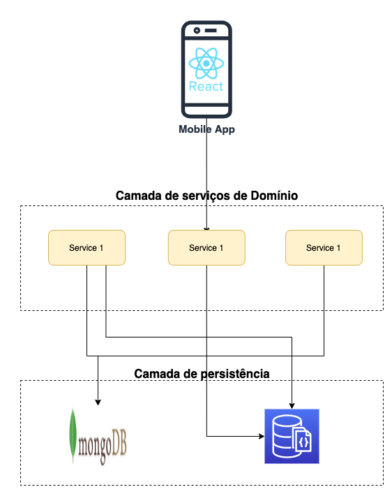
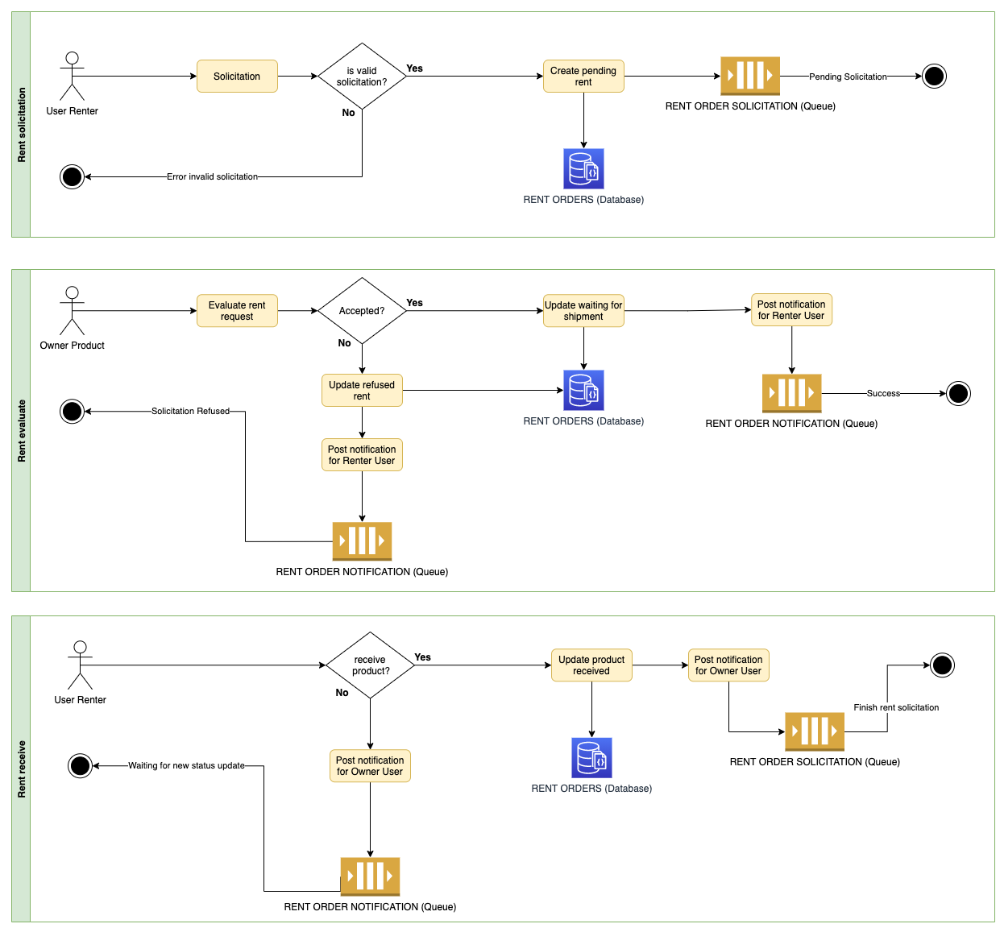

# rentup

    RentUp - Alugue qualquer coisa!

RentUp é um sistema desenvolvido para a disciplina Prática em Desenvolvimento de Software da Universidade Federal de Minas Gerais.

## Equipe

- [Fábio Alves Pereira](https://github.com/fabiopereira96) (Backend)
- [Samuel Jesus Pereira Cunha](https://github.com/samuelcunha) (Frontend)

## Escopo Funcional

Seu objetivo é permitir que pessoas aluguem itens de qualquer forma ou categoria, desde uma chave de fenda que possui em seu porão até aparelhos eletrônicos e domésticos.

Para isso, o sistema terá um amplo catálogo de produtos e categorias pré-estabelecidas com faixas de preços sugeridas e históricos de alocações semelhantes. Além disso, cada cliente poderá se cadastrar no sistema por meio de um cadastro único, tanto para locadores quanto para locatários.

Com seu cadastro realizado, é possível incluir novos produtos ao seu portfólio de alocações ou procurar itens para realizar o aluguel por proximidade, categorias ou faixas de preços.

## Tecnologias utilizadas

- Backend: Java, Quarkus
- Frontend: React
- BD: NoSQL (MongoDB)
- Testes: JUnit, Jest, Cypress
- Linter: ESLint, Prettier
- CI/CD: Github Actions
- Logging/Analytics: Firebase
- Quality: SonarCloud

## Histórias de Usuário

- Como usuário, quero me cadastrar na plataforma, infomando meus dados pessoais e minha localização, podendo utilizar a mesma conta tanto para alugar como para anunciar itens;
- Como usuário, quero me autenticar na plataforma com e-mail e senha;
- Como locatário, quero pesquisar um item a partir de seu nome, podendo filtrar por proximidade, categorias ou faixas de preços;
- Como locatário, quero solicitar a locação de um item por um período em dias e pagar um percentual do valor para garantir a reserva;
- Como locatário, quero cadastrar meu cartão de crédito para realizar pagamentos;
- Como locatário, quero pagar o valor restante da locação e deixar uma avaliação ao devolver o item;
- Como locatário, devo pagar uma multa caso ultrapasse o prazo em dias acordado;
- Como locador, quero adicionar novos itens para locação, adicionando uma breve descrição, preço por dia, fotos e selecionar uma categoria correspondente;
- Como locador, quero visualizar as solicitações de locação de meus itens;
- Como locador, quero aprovar uma solicitação de locação.

## [Kanban](https://github.com/samuelcunha/rentup/projects/1)

## Arquitetura Geral

Nosso projeto arquitetural consiste em um dispositivo mobile que fará requisições
REST para o Backend da aplicação dividido por domínios de negócios e com Clients
relacionados a chamadas HTTP e conexões com Bancos de Dados Relacionais e Não Relacionais.

## Modelagem de locação de produtos

A principal funcionalidade de nosso sistema é o fluxo de locação de produtos por nossos clientes.
Para esse processo, criamos a modelagem abaixo que exemplifica nosso processo de forma assíncrona:

- Filas para comunicação entre processos
- Tabela para manter o ciclo de vida da solicitação.

